# Beckhoff XTS Prime Mover Manufacturing Simulation

WPF + .NET 10 simulation of a Beckhoff-style XTS transport line with service-driven logic, MVVM visualization, SQLite traceability, watchdog recovery, and operator-focused HMI diagnostics.

## Current Implemented Scope

- .NET target: `net10.0-windows`
- UI: WPF (MVVM)
- Transport: 10 movers on oval/stadium XTS track visualization
- Process cells: 4 machines (Laser Welder, Assembler, Inspector, Tester)
- Transfers: 4 robots (mover ↔ machine)
- Station chains: 18 total stations
- Persistence: SQLite (`XTSFactorySim.db` in output path)
- Runtime split-ready gateway boundaries:
  - `IMachineGatewayService` (machine commands + telemetry)
  - `IDataGatewayService` (history/tables/export)
  - `LocalSimulationServiceGateway` implements both interfaces for local mode
  - `RemoteTwinCatMachineGatewayMock` simulates remote machine boundary with configurable latency
- Runtime gateway mode toggle via app resources in `App.xaml`
- PLC/TwinCAT-style FBs:
  - Motion FBs (`McPower`, `McMoveVelocity`, `McHalt`, `FbXtsMoverAxis`)
  - Process FBs (`TON`, alarm latch, machine cycle sequencer)

## Runtime Behavior (as implemented)

- Deterministic routing: `M0 -> M1 -> M2 -> M3 -> Exit`
- Machine sequencer states: `Init`, `Ready`, `Run`, `Fault`, `Reset`
- ET/PT timeout supervision per station (TON)
- Queue spacing on movers to reduce overlap/stacking
- Entry/Exit zone blink indicators tied to real load/unload events
- Watchdog supervision + controlled recovery:
  - machine stall
  - robot stall
  - mover stall
  - rehome/scrap fallback + root-cause alarm codes

## HMI / Operator Diagnostics

### Main visualization
- Beckhoff-like oval track with lane markings, seams/module look
- Entry / Load and Exit / Unload zones with live blinkers
- Machine mini-HMIs on main canvas with outward spacing for readability
- Robot transfer overlays on canvas:
  - moving robot glyphs between mover dock and machine dock points
  - animated dashed transfer lines with glow
  - direction arrowheads at active destination end

### Visualization Screens
> Indexed in navigation order for first-time visitors.

#### 1) Main line visualization overview
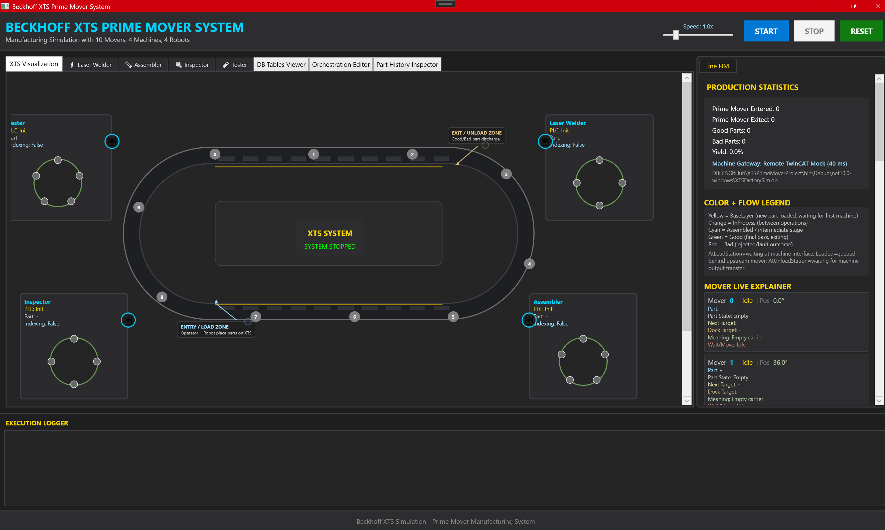

#### 2) Production statistics section
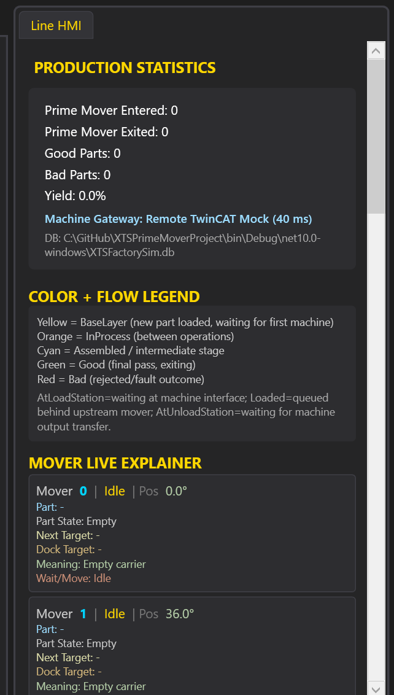

#### 3) Mover live explainer section
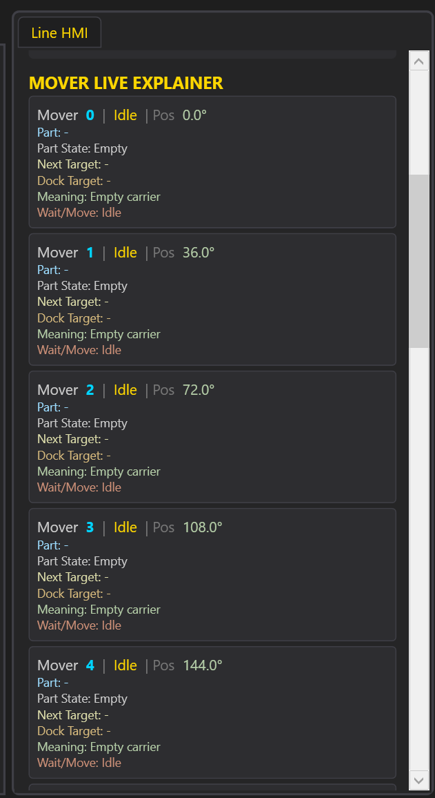

#### 4) Machine runtime tracking section
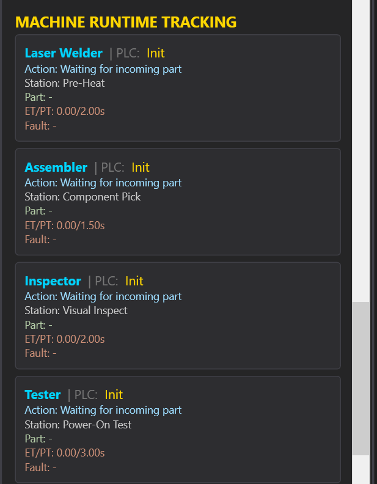

#### 5) Robot transfers (mover to machine)
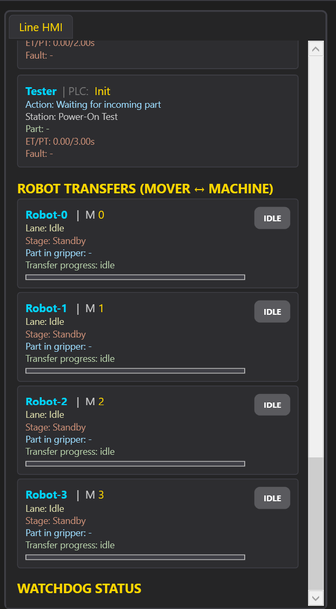

#### 6) Laser welder station view
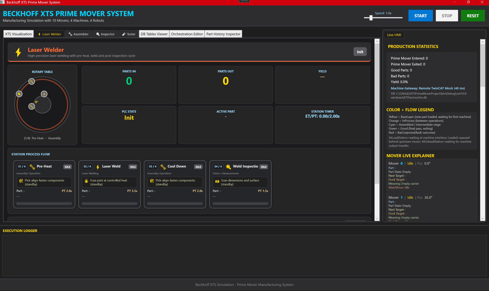

#### 7) Assembly station view
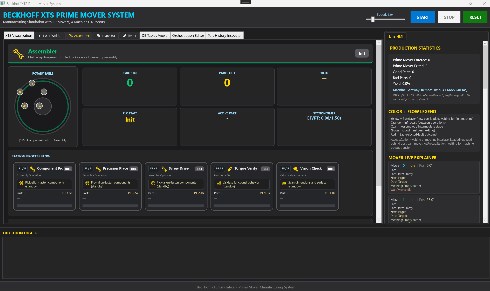

#### 8) Inspection station view
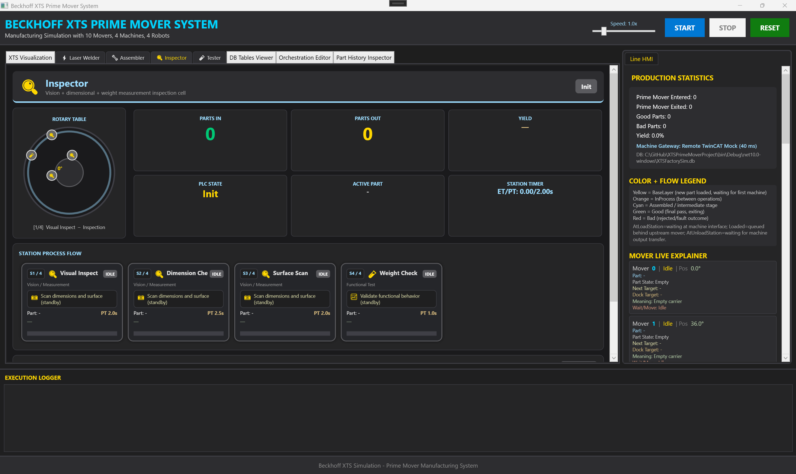

#### 9) Testing station view
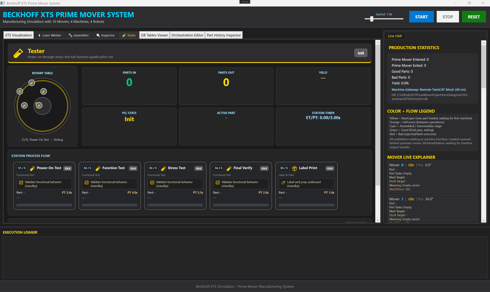

#### 10) Orchestration editor screen
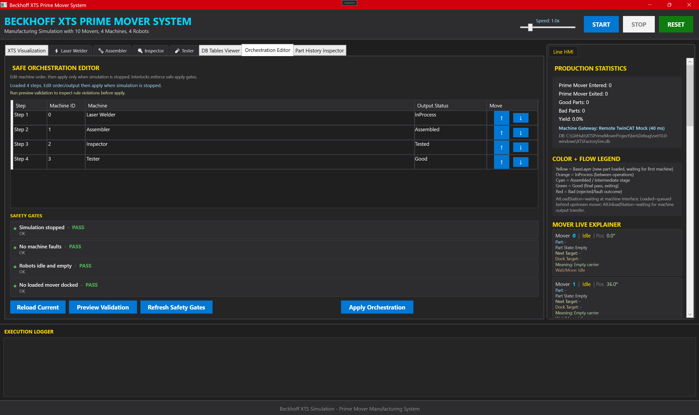

#### 11) Part history inspection screen
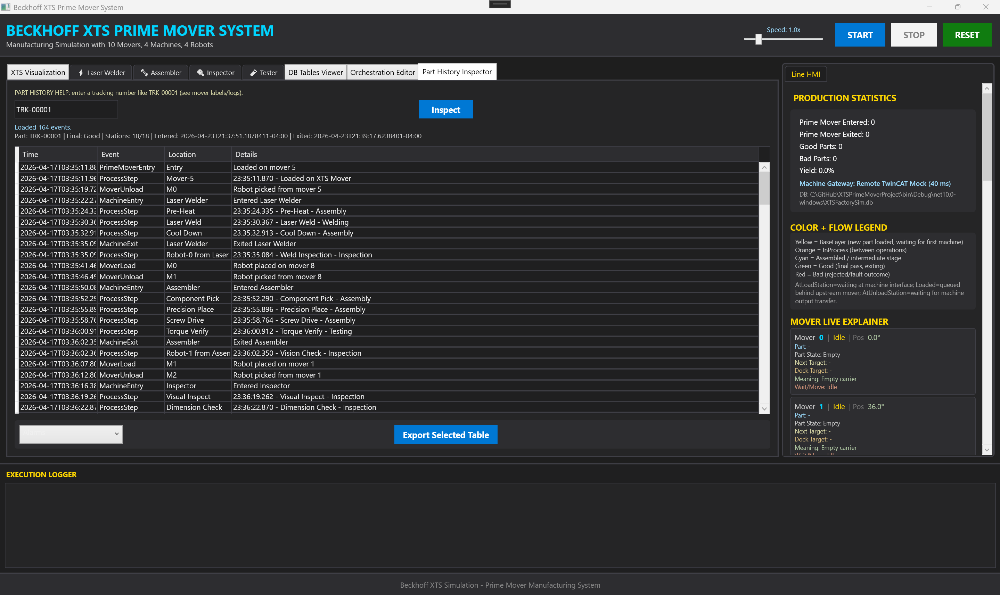

#### 12) Database tables view screen
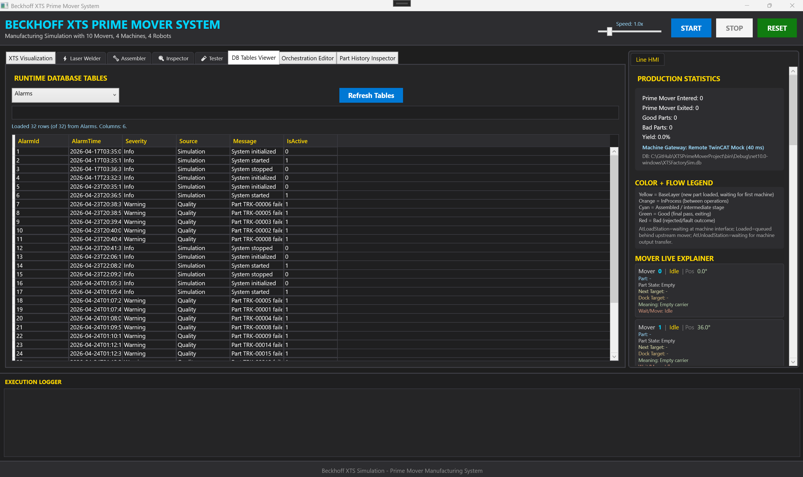

#### 13) Runtime execution logger
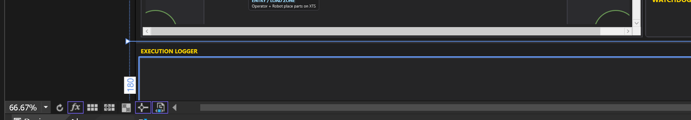

### HMI Screen Recording
- [Watch the HMI runtime recording (YouTube - Unlisted)](https://www.youtube.com/watch?v=cIq1iMvu8MY)

- Citation: YouTube (unlisted) project runtime demo — `https://www.youtube.com/watch?v=cIq1iMvu8MY`

### Line HMI (right panel)
- Production counters and yield
- Gateway mode indicator (Local vs Remote TwinCAT Mock)
- Color/flow legend (what yellow/BaseLayer means, etc.)
- Mover live explainer:
  - state, part, next target, wait reason, position
- Machine runtime tracking:
  - action, station, part, ET/PT, fault text
- Robot transfer status and progress:
  - lane direction, stage, transfer progress, active/idle badge
- Watchdog status table (code/count/last object/time/message)

### Execution Logger (bottom)
- Auto-scroll runtime log stream for movement, transfers, alarms, recoveries

## SQLite Logging

Tables currently used:
- `Recipes`
- `Parts`
- `PartEvents`
- `MachineRuns`
- `Results`
- `ProductionSnapshots`
- `ErrorLogs`
- `Alarms`

## Build / Run

1. Open solution in Visual Studio 2026+.
2. Restore/build (`Debug | Any CPU`).
3. Run with `F5`.
4. Use header controls:
   - `START`
   - `STOP`
   - `RESET`
   - Speed slider (`0.1x` .. `5.0x`)

## Continue Development on Another Laptop (Copilot-friendly)

1. Clone repo:
   - `git clone https://github.com/anoop6543/XTSPrimeMoverProject`
2. Open in Visual Studio with same GitHub account used for Copilot.
3. Ensure Copilot is enabled in VS.
4. Read these first:
   - `README.md`
   - `docs/ARCHITECTURE.md`
   - `AGENTS.md`
5. Build once before edits.
6. Prefer service/model changes first, then ViewModel, then XAML.

### About “Copilot history retained”
- Retain history context by committing/pushing project docs (`README`, `ARCHITECTURE`, `AGENTS`) and code changes.
- Use same GitHub account + same repo branch context.
- Chat/session history itself is environment-dependent; the canonical persistent context for future Copilot runs is the repo content and these docs.

## Key Files

- Engine: `Services/XTSSimulationEngine.cs`
- Logging: `Services/SimulationDataLogger.cs`
- PLC/Motion FBs: `Services/TwinCAT*.cs`
- Models: `Models/*.cs`
- View root: `ViewModels/MainViewModel.cs`
- Machine/data gateway contracts: `Services/HmiServiceContracts.cs`
- Local gateway adapter: `Services/LocalSimulationServiceGateway.cs`
- Remote machine mock: `Services/RemoteTwinCatMock/RemoteTwinCatMachineGatewayMock.cs`
- Main UI: `MainWindow.xaml`
- Architecture: `docs/ARCHITECTURE.md`
- Split-runtime plan: `docs/SEPARATED-RUNTIME-PLAN.md`
- Agent context: `AGENTS.md`
