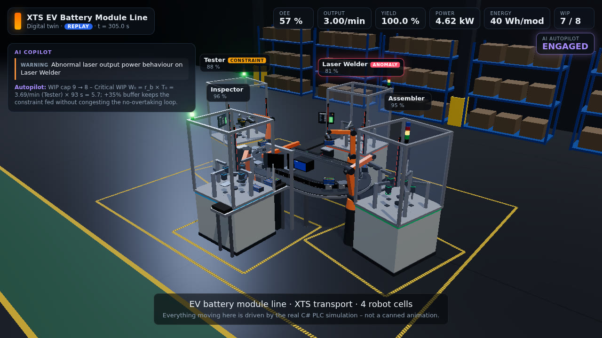
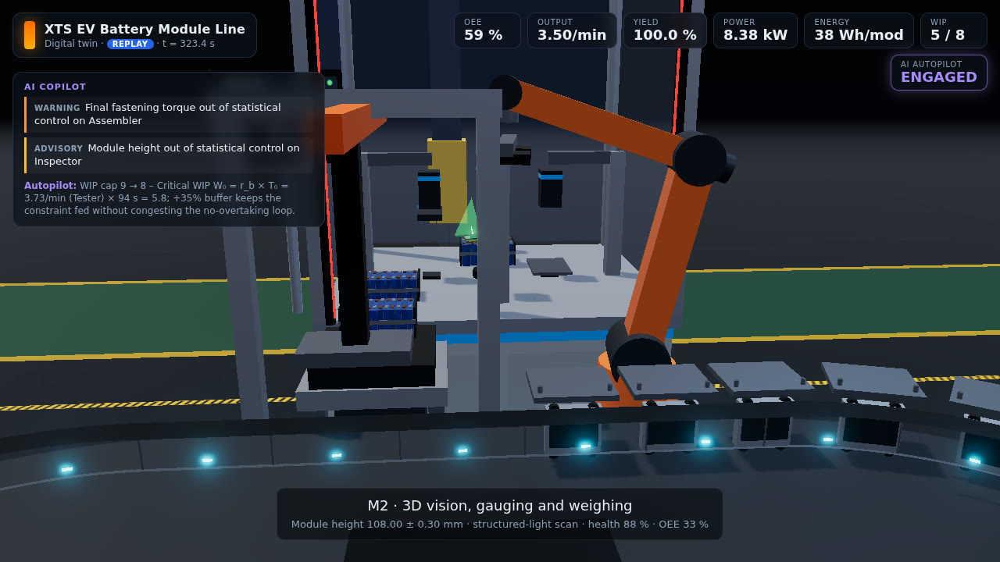
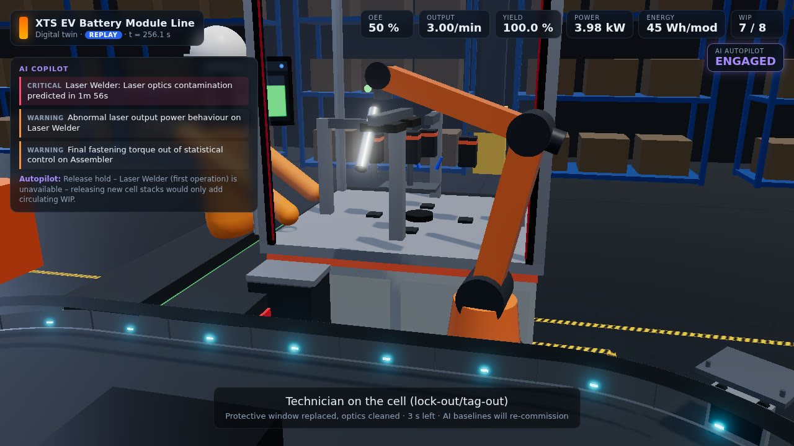

# XTS Prime Mover · EV Battery Module Line · AI Digital Twin

A physics-true, AI-driven simulation of a Beckhoff-style **XTS** linear-transport line assembling
**12S prismatic EV battery modules** – with a live **3D digital twin**, an **AI autopilot**,
predictive maintenance, SPC and an optional **Claude** copilot. No hardware required.

- **Runtime core** (`Core/`, .NET 10, cross-platform): PLC-style engine, motion + process function blocks,
  digital twins, AI analytics, SQLite traceability. Runs inside the WPF HMI, headless in tests and in the video recorder.
- **HMI** (WPF, `net10.0-windows`): AI Command Center, live Three.js 3D twin (WebView2), native WPF 3D (HelixToolkit), classic 2D HMI.
- **Verified**: 26 xUnit tests run the real engine headless (no collisions, no deadlocks, fault → detection → maintenance with zero breakdowns).

## Watch it – 3D digital twin

Rendered frame by frame from the **real engine** (recorded headlessly, then rendered by the same Three.js
twin the HMI shows – not a canned animation).

| Line overview (zoom out → follow a mover → dock swap → infeed/outfeed) | Station close-ups (laser weld · fastening · 3D vision · EOL test) | AI scenario: fault → anomaly → predictive maintenance |
|---|---|---|
| [](docs/videos/xts-line-overview.mp4) | [](docs/videos/xts-station-closeups.mp4) | [](docs/videos/xts-ai-predictive-maintenance.mp4) |
| [`xts-line-overview.mp4`](docs/videos/xts-line-overview.mp4) · 30 s | [`xts-station-closeups.mp4`](docs/videos/xts-station-closeups.mp4) · 40 s | [`xts-ai-predictive-maintenance.mp4`](docs/videos/xts-ai-predictive-maintenance.mp4) · 36 s |

In the app the same twin runs **live** in the *3D Digital Twin* tab: orbit / zoom with the mouse, camera presets
(overview, M0–M3, follow mover) and a **Cinematic tour** button.

## What makes it realistic

**Transport (XTS)**
- Fixed 20 ms PLC cycle (deterministic at any sim speed), jerk-limited S-curve motion (MC_MoveVelocity-style FB).
- Movers **never overtake**: braking-curve anti-collision gap control (12 cm pitch), millimetre docking at stop points.
- Timed entry dock (12S cell-stack load) and exit dock (module unload, good/reject chutes).

**Robot cells**
- Rotary-index machines with an **outfeed nest**; **dual-gripper** robots pre-fetch the finished module and
  **swap** at the dock (raw in, finished out). The constraint is loaded first ("protect the bottleneck").
- This makes a single no-overtaking loop deadlock-free – verified by a 10-minute headless test.

**Product & quality** – stations measure real characteristics with spec limits and qualified Cpk:

| Cell | Process | Key characteristic | Watched failure mode → sensor |
|---|---|---|---|
| M0 Laser Welder | cell-stack compression, busbar laser weld, OCT seam scan | weld penetration 1.20 ± 0.20 mm | optics contamination → laser output power |
| M1 Assembler | CMU board pick/place, screw fastening, torque/angle, connector vision | final torque 2.50 ± 0.25 N·m | spindle bearing wear → motor current, vibration |
| M2 Inspector | 3D vision, height gauge, busbar surface, weighing | module height 108.00 ± 0.30 mm | ring-light drift → illumination intensity |
| M3 Tester | HiPot, OCV & DC-IR, BMS balancing, EOL, DMC marking | DC-IR 3.20 ± 0.80 mΩ | pogo-pin wear → contact resistance |

A part is rejected because a **measured value** leaves its spec window – degradation shifts the mean and inflates
sigma, so yield drops *because* an asset wears, exactly like a real line.

## The AI layer (`Core/Services/Intelligence`)

| Capability | Method |
|---|---|
| Digital twin per cell | hidden damage state on a P-F curve, thermal model + healthy **shadow model**, noisy sensors |
| Anomaly detection | residual vs shadow model, context-aware (running/idle), EWMA with exact limits + two-sided CUSUM, adaptive baseline |
| Remaining useful life | exponential degradation model, multi-horizon least squares (20/60/150/300 s), cross-horizon confidence |
| SPC | individuals chart, Western Electric rules 1–4 + Nelson trend, rolling Cpk |
| OEE | ISO 22400 time model per machine and line (A × P × Q) |
| Bottleneck | active-period method (Roser), shifting-bottleneck detection |
| Energy | mover force/power model (inertia, friction, eddy drag, copper loss), machine/robot duty power, Wh/module, CO₂ |
| Forecast | Holt double-exponential smoothing of throughput |
| **Autopilot** | release control by **critical WIP W₀ = r_b × T₀** (Hopp & Spearman) + predictive maintenance scheduled on RUL vs. maintenance lead time, one technician, explainable decision log |
| **Copilot** | offline reasoning engine (ranked insights with evidence + recommendation + confidence, Q&A) and optional **Claude** (`claude-opus-5-5`) grounded on a JSON snapshot of the line |
| What-if | inject laser contamination, spindle bearing defect, vision drift, pogo-pin wear, robot vacuum leak |

### Measured results (headless, 4 seeds × 15 sim-minutes, `Release`)

| | Manual (fixed WIP 9) | AI autopilot |
|---|---|---|
| Output | 2.75 modules/min | **2.82 modules/min** (+2.5 %) |
| Lead time | 167 s | **152 s** (−9 %) |
| Energy | 38.3 Wh/module | **34.7 Wh/module** (−9 %) |
| Laser-optics fault, 4 runs × 300 s | 4 breakdowns, 5 rejects | **0 breakdowns**, 4 rejects |

An "eco-glide" speed-reduction idea was measured and **removed**: on a no-overtaking loop it slowed the movers
behind and increased energy per module.

## Architecture

```text
Core (net10.0, no WPF)                                     HMI (WPF net10.0-windows)
┌───────────────────────────────────────────────┐          ┌──────────────────────────────────────┐
│ XTSSimulationEngine (20 ms fixed PLC cycle)    │ gateway  │ MainViewModel + IntelligenceViewModel │
│  ├ motion FBs (S-curve) · machine cycle FBs   │◄────────►│ AI Command Center · 2D HMI · tabs     │
│  ├ transport planner (gap control, docking)   │ contracts│ DigitalTwinWebHost ──► WebView2       │
│  ├ dual-gripper cell controllers              │          │      Three.js twin (Web/twin)         │
│  └ LineIntelligenceHub (twins, PdM, SPC, OEE, │          │ NativeLineView3D (HelixToolkit)       │
│     bottleneck, energy, autopilot, copilot)   │          └──────────────────────────────────────┘
│ SimulationDataLogger → SQLite (write queue)    │
│ TwinFrameBuilder (3D contract)                 │──► tools/TwinRecorder (headless) ──► tools/video (Playwright + ffmpeg)
└───────────────────────────────────────────────┘
```

Details: [`docs/ARCHITECTURE.md`](docs/ARCHITECTURE.md).

## Build · run · test

**Run the HMI (Windows)** – Visual Studio 2026 / .NET 10 SDK, open `XTSPrimeMoverProject.slnx`, start `XTSPrimeMoverProject`.
The 3D tab needs the Microsoft Edge **WebView2 Runtime** (preinstalled on Windows 10/11); without it, use *Native 3D (WPF)*.

**Optional Claude copilot** – set `ANTHROPIC_API_KEY` (or log in with `ant auth login`) and tick *Use Claude* in the
AI Command Center. Without it the offline copilot answers; nothing leaves the machine.

**Tests (any OS)**
```bash
dotnet test tests/XTSPrimeMoverProject.Tests
```

**Build on Linux/macOS (compile check of the WPF project)**
```bash
dotnet build XTSPrimeMoverProject.csproj -p:EnableWindowsTargeting=true
```

**Standalone web twin** (demo loop recorded from the engine)
```bash
npx serve Web/twin   # then open http://localhost:3000
```

**Re-render the videos** (needs .NET 10, Node 18+, Chromium, ffmpeg)
```bash
cd tools/video && npm install && CHROMIUM_PATH=/path/to/chrome ./render-all.sh
```
`tools/TwinRecorder` runs the real engine headless and exports frames (`--fault laser --autopilot --speed 3 …`);
`tools/video/capture.mjs` renders them deterministically, one WebGL frame per video frame.

## Line HMI tabs

- **3D Digital Twin** – live Three.js twin: PBR materials, shadows, bloom, andon towers, live cell HMIs, robots with IK, battery modules that build up stage by stage, technician during maintenance, cinematic tour.
- **AI Command Center** – line OEE gauge, output/energy trends, WIP vs critical WIP, per-machine health rings, RUL, anomaly state, sensor trends, SPC chart with limits and rule markers, OEE losses, *Schedule maintenance*, autopilot toggle, what-if fault injection, copilot chat, insight feed and autopilot decision log.
- **XTS Visualization (2D)**, machine tabs (now with per-station measurements and wear slowdown), DB tables viewer, orchestration editor, part history inspector, execution logger – as before.
- **Native 3D (WPF)** – HelixToolkit view with orbit/zoom, presets and a fly-through tour (no browser runtime).

### Classic 2D HMI screens
> Indexed in navigation order for first-time visitors.

#### 1) Main line visualization overview


#### 2) Production statistics section


#### 3) Mover live explainer section


#### 4) Machine runtime tracking section


#### 5) Robot transfers (mover to machine)


#### 6) Laser welder station view


#### 7) Assembly station view


#### 8) Inspection station view


#### 9) Testing station view


#### 10) Orchestration editor screen


#### 11) Part history inspection screen


#### 12) Database tables view screen


#### 13) Runtime execution logger


### HMI Screen Recording
- [Watch the HMI runtime recording (YouTube - Unlisted)](https://www.youtube.com/watch?v=cIq1iMvu8MY)

[](https://www.youtube.com/watch?v=cIq1iMvu8MY)

- Citation: YouTube (unlisted) project runtime demo — `https://www.youtube.com/watch?v=cIq1iMvu8MY`

### Line HMI (right panel)
- Production counters and yield
- Gateway mode indicator (Local vs Remote TwinCAT Mock)
- Color/flow legend (what yellow/BaseLayer means, etc.)
- Mover live explainer:
  - state, part, next target, wait reason, position
- Machine runtime tracking:
  - action, station, part, ET/PT, fault text
- Robot transfer status and progress:
  - lane direction, stage, transfer progress, active/idle badge
- Watchdog status table (code/count/last object/time/message)

### Execution Logger (bottom)
- Auto-scroll runtime log stream for movement, transfers, alarms, recoveries

## SQLite Logging

Tables (schema unchanged): `Recipes`, `Parts`, `PartEvents`, `MachineRuns`, `Results`, `ProductionSnapshots`,
`ErrorLogs`, `Alarms`. Every station measurement is part of the part genealogy (`PartEvents` → `ProcessStep`),
AI events (anomalies, SPC rule violations, maintenance, breakdowns) are written to `Alarms`.

## Key files

| Area | Path |
|---|---|
| Engine (transport, cells, watchdogs) | `Core/Services/XTSSimulationEngine.cs` |
| Motion / PLC function blocks | `Core/Services/TwinCATMotionFunctionBlocks.cs`, `Core/Services/TwinCATPlcFunctionBlocks.cs` |
| AI layer | `Core/Services/Intelligence/*.cs` (hub, twins, anomaly, RUL, SPC, OEE, autopilot, copilot, Claude client) |
| 3D contract | `Core/Services/DigitalTwin3D/TwinFrame.cs` |
| Models | `Core/Models/*.cs` |
| Gateways | `Core/Services/HmiServiceContracts.cs`, `LocalSimulationServiceGateway.cs`, `RemoteTwinCatMock/` |
| View models | `ViewModels/MainViewModel.cs`, `ViewModels/IntelligenceViewModel.cs` |
| WPF 3D / bridge | `Controls/NativeLineView3D.cs`, `Infrastructure/DigitalTwinWebHost.cs` |
| Three.js twin | `Web/twin/` (vendored three.js r186, MIT) |
| Tests | `tests/XTSPrimeMoverProject.Tests/` |
| Recorder / video | `tools/TwinRecorder/`, `tools/video/` |
| Docs | `docs/ARCHITECTURE.md`, `docs/SEPARATED-RUNTIME-PLAN.md`, `AGENTS.md` |
